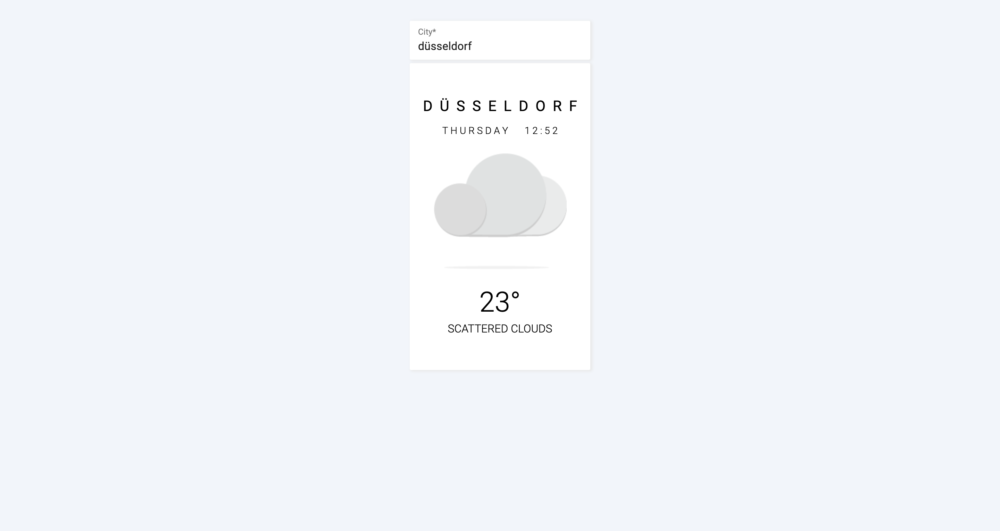

# Current Weather
A simple and clean current weather application built using React, Redux Toolkit and Material-UI Framework. [openweathermap](https://openweathermap.org/current/) API is used to fetch the current weather data. For E2E testing, Cypress is used.

	

## Content
- [X] Debounce on Input: To prevent UI code from needing to process every event and to drastically reduces the number of API calls sent to the server
- [X] Use of Material-UI Framework
- [X] Use of openweathermap API to fetch weather data
- [X] An automatic refresh weather data after each minute
- [X] Use of Redux Toolkit (RTK) for handling app state and async calls

## E2E Tests

	

## Libraries and Frameworks

#### External 
- [X] [Create React App](https://github.com/facebook/create-react-app)
- [X] [Redux Toolkit](https://redux-toolkit.js.org/)
- [X] [Redux Devtools Extension](https://github.com/zalmoxisus/redux-devtools-extension)
- [X] [Material-UI](https://material-ui.com/)
- [X] [Cypress](https://www.cypress.io)

## Information
Check [React-Seed](https://github.com/imransilvake/React-Seed) to understand how to build and serve this project as well as how to use SCSS and JS linting.
